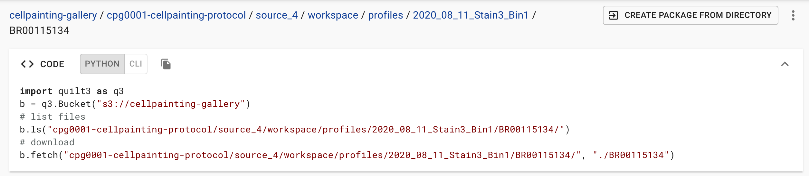

# Downloading from Cell Painting Gallery

Before downloading from the Cell Painting Gallery, please read our comprehensive description of [folder structure](folder_structure.md) so that you understand the structure of the data you will be downloading.

We provide below instructions for downloading data using Quilt or AWS CLI.

## Preparation

Before initiating a download, consider what kind and how much data you need.
Most datasets have both images and profiles.
Most datasets have multiple batches.
Not all datasets and not all batches have been described in a publication.
Browse the data to determine the batch/plate/file names that you would like to download.

We recommend [browsing the data](browsing_data.md) before initiating download.

## Using Quilt to generate download commands

Once you have browsed to the location of your desired files in [the Cell Painting Gallery indexed on Quilt](https://open.quiltdata.com/b/cellpainting-gallery/tree/), select the `CODE` bar to expand that section.
It will reveal two tabs: `PYTHON` and `CLI`.

### Downloading with Quilt Python command



The `PYTHON` tab returns a download command that will download files using Quilt's Python client.
The structure of the download command is `b.fetch("CPG_LOCATION", "LOCAL_DESTINATION")` so if you would like to control where the files are downloaded to, simply edit the local destination path.

Before using the Python download command, you will ned to install the Quilt Python client with the command `pip install quilt3`. (See [Quilt's installation documentation](https://docs.quiltdata.com/installation) for more information.)

### Downloading with Quilt AWS CLI command


The `CLI` tab returns a download command that will download files using [AWS CLI](https://aws.amazon.com/cli/).
The structure of the download command is `aws s3 cp --recursive "CPG_LOCATION" "LOCAL_DESTINATION"` so if you would like to control where the files are downloaded to, simply edit the local destination path.

Before using the AWS CLI command, you will need to install AWS CLI following [AWS documentation](https://docs.aws.amazon.com/cli/latest/userguide/getting-started-install.html).

You do NOT need an AWS account to download files from the Cell Painting Gallery.
If you do not have an AWS account and get an error with the AWS CLI command provided, add `--no-sign-request` to the end of the command.
e.g. `aws s3 cp --recursive "CPG_LOCATION" "LOCAL_DESTINATION" --no-sign-request`

## Generating your own AWS CLI download commands

Before using AWS CLI, you will need to install AWS CLI following [AWS documentation](https://docs.aws.amazon.com/cli/latest/userguide/getting-started-install.html).

### Downloading a whole dataset

Perhaps the simplest download command is to download a whole dataset.
However, before doing so, we encourage you to look carefully at the [README](README.md) so that you are aware of the size of the dataset that you are downloading.

In your terminal, navigate into the folder that you would like to download into.
Run the following command to see a listing of all files that would be downloaded with your command.
If your source and destination paths are as expected, remove `--dryrun` from the command and run it again.

```bash
DATASET=cpg0000-jump-pilot
aws s3 cp --recursive s3://cellpainting-gallery/${DATASET}/ . --no-sign-request --dryrun
```

### Downloading data subsets

In your terminal, navigate into the folder that you would like to download into.
Use the the provided [folder structure](data_structure.md) documentation and browse the data with a storage browser or [by listing](browsing_data.md) to determine the path (i.e. prefix) you would like to download.

Below we provide several examples of download commands.

We suggest you always first run download commands with the `--dryrun` command to see a listing of all files that would be downloaded with your command.
If your source and destination paths are as expected, remove `--dryrun` from the command and run it again.

If you would like to download a subset of data with a common prefix (i.e. folder nesting) then use the `--include` and `--exclude` flags in your command.
We suggest the format of `--exclude "*" --include "*yourfilter*"` to exclude all files from the download command and then include only the files that have your specified filter.

The copy command examples provided follow the format of `aws s3 cp --recursive` SOURCE DESTINATION `--no-sign-request --dryrun`.
When files download, they will maintain any folder structure below the prefix that you are downloading from.
You can create/define additional folders by editing the DESTINATION.

e.g. download a single plate of images

```bash
aws s3 cp --recursive s3://cellpainting-gallery/cpg0000-jump-pilot/source_4/images/2020_11_04_CPJUMP1/images/BR00116991__2020-11-05T19_51_35-Measurement1/ . --no-sign-request --dryrun
```

e.g. download all platemaps to a platemap folder

```bash
aws s3 cp --recursive s3://cellpainting-gallery/cpg0000-jump-pilot/source_4/workspace/metadata/platemaps/ platemap/ --no-sign-request --dryrun
```

e.g. download all backends that are in .csv format to a backend folder

```bash
aws s3 cp --recursive s3://cellpainting-gallery/cpg0000-jump-pilot/source_4/workspace/backend/ backend/ --exclude "*" --include "*.csv" --no-sign-request --dryrun
```
