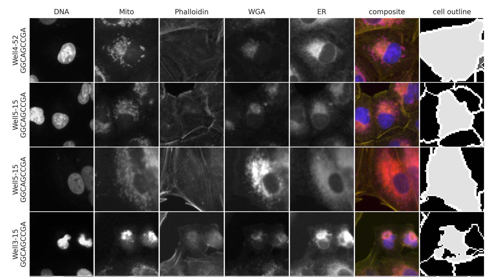

# Workflows using the Cell Painting Gallery

Data in the Cell Painting Gallery can be used for many different purposes in many different ways.
We provide here links to external workflows that access Cell Painting Gallery data to serve as inspiration for others in making their own workflows.

## CellPose

Workflow: [Segment images in cpg0016-jump using CellPose in a SnakeMake pipeline](https://github.com/theislab/jump-cpg0016-segmentation).

[CellPose](https://www.cellpose.org) is an open-source generalist algorithm for cellular segmentation.
[Snakemake](https://snakemake.github.io) is an open-source workflow engine that provides a readable Python-based workflow definition language and execution environment.

This workflow was used to create single-cell crops from the entire `cpg0016-jump` dataset and can be customized to run on subsets filtered by Metadata such as Source, Batch, Plate, Well Site, and InChIKey.

## Distributed-CellProfiler

Workflow: [Load images in cpg0016-jump, make measurements, and output image crops using Distributed-CellProfiler](https://github.com/DistributedScience/Distributed-CellProfiler/tree/master/example_project_cpg).

[Distributed-CellProfiler](https://github.com/DistributedScience/Distributed-CellProfiler) is simple, open-source Python software for running encapsulated docker containers with CellProfiler in the Amazon Web Services (AWS) infrastructure.
[CellProfiler](https://cellprofiler.org) is an open-source image analysis software that excels in GUI or headless handling of high-content workflows.
CellProfiler has dozens of native image and object handling modules as well as the ability to run [custom modules](https://github.com/CellProfiler/CellProfiler-plugins) (i.e. plugins).
CellProfiler-plugins include modules that call out to other softwares such as open-source image analysis software [ImageJ/FIJI](https://github.com/CellProfiler/CellProfiler-plugins/blob/master/active_plugins/runimagejscript.py), including open-source Deep Learning softwares such as [CellPose](https://github.com/CellProfiler/CellProfiler-plugins/blob/master/active_plugins/runcellpose.py) and [Stardist](https://github.com/CellProfiler/CellProfiler-plugins/blob/master/active_plugins/runstardist.py).

This workflow is a minimal example used to demonstrate data access from the CellPainting-Gallery.
Distributed-CellProfiler workflows have been used to generate most of the illumination correction files and classic morphological profiles found in the CellPainting-Gallery.

Though we don't have separate tutorials at this point in time, other softwares in the [DistributedScience](https://github.com/DistributedScience) suite (such as [Distributed-FIJI](https://github.com/DistributedScience/Distributed-Fiji) or [Distributed-OMEZarrCreator](https://github.com/DistributedScience/Distributed-OMEZarrCreator)) can be similarly used to access data in the Cell Painting Gallery.

## cpg0021-periscope representative cell image retrieval

The PERISCOPE dataset provides a tool for retrieving single cell image crops for each of the three whole-genome screens included in the dataset. The number of cells returned and bounding box size are configurable.
Cells can either be representative or random for any given gene or CRISPR guide.
The tool can be found in the [paper repository](https://github.com/broadinstitute/2022_PERISCOPE/tree/main/Supplemental_5).
